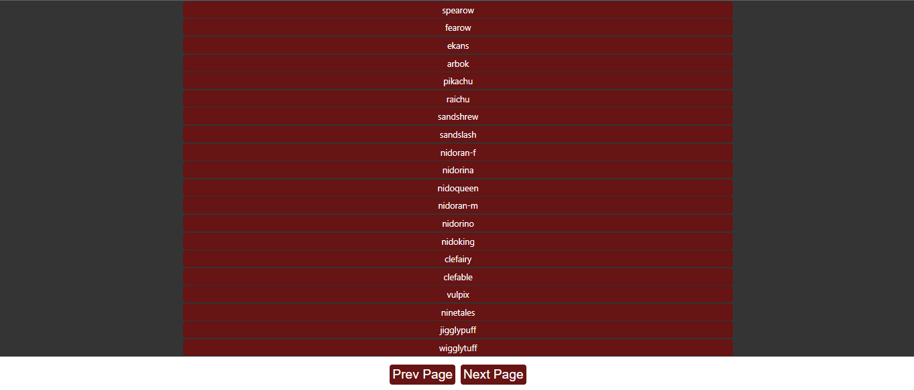

# Pokemon application live :

https://654922bd9aa76209dfa67e88--heroic-treacle-e83d7d.netlify.app/

# Used Tools:

1-Html5  
2-Css3  
3-Javascript 
4-React.js  
5-React Hooks [useState,useEffect]  
6-Fetch Data (axios)  
7-pagination

## Api Link :

https://pokeapi.co/api/v2/pokemon

# Main Features Of App

-user can click next page button to see the next names  
-user can click previous page button to see the previous names  
